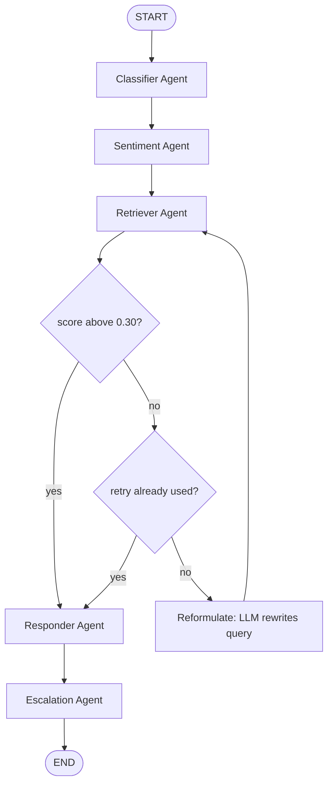

# AgentCRM

I studied Computer Science at Columbia University, and I've been fascinated by how companies like Salesforce use AI to manage customer relationships at scale. I built AgentCRM to understand that from the inside, by actually building it, and specifically to answer a question that generic chatbot demos gloss over: how do you make sure the response is actually grounded in real company knowledge instead of a plausible-sounding guess?

This is a five-agent system that classifies, retrieves, responds to, and escalates customer support tickets, with a retrieval-augmented generation layer sitting in the middle and an eval harness to measure whether that retrieval is actually working. It exists in two versions now. v1 runs the five agents as a fixed sequence. v2 rebuilds the orchestration with LangGraph, after running into a real limitation in v1 that a fixed pipeline can't fix on its own.

---

## v2: from pipeline to agent

v1 works, but it is a fixed sequence. Classifier runs, then Sentiment, then Retriever, then Responder, then Escalation, in that order, every single time, no matter what any of them find. Nothing in that chain makes a decision based on what happened earlier in the same run. That's not an actual agent, but "a pipeline wearing agent branding."

The one place that gap actually costs something is retrieval. If the Retriever comes back with a weak match, v1 just keeps going anyway. The Responder either grounds a reply in something barely related, or the `grounded: false` flag does its job quietly and nobody upstream ever tries the search again.

v2 keeps all five original agents exactly as they are and adds the one piece that was missing: a real decision point after retrieval.



**Reformulate is an LLM call, not keyword stripping.** When Retrieve comes back under threshold, Reformulate is handed the original query plus whatever weak matches did come back, even the ones below the cutoff, and asks the model to name the likely reason the search missed and rewrite the query toward the knowledge base's own language. Most retrieval misses are a vocabulary gap between how a customer describes a problem and how the KB describes the answer, not noise words in the query, so stripping stopwords doesn't actually touch the real problem. An LLM that can see the near-misses can reason about the actual mismatch instead of just mechanically trimming the input.

**The retry is capped at one.** If the rewritten query also misses, the graph falls through to Respond anyway, with `grounded: False` carried through, so the response is honest about not having a confident answer instead of either looping forever or quietly padding a low-confidence guess with a "Based on our knowledge base" claim it hasn't earned.

The five agents themselves are unchanged, see "How it works" below. Only the orchestration around them is new.

```bash
python3 graph.py
```

runs the v2 graph on a demo ticket.

---

## How it works

Five agents, used by both v1 and v2:

1. **Classifier Agent**: categorizes the ticket (billing, bug, feature
   request, support, account) using keyword matching, and assigns a priority
2. **Sentiment Agent**: reads tone (angry, frustrated, calm, neutral) so the
   response strategy can adjust, also keyword-based
3. **Retriever Agent**: embeds the ticket text with OpenAI's
   `text-embedding-3-small`, queries a persisted Chroma vector store, and
   pulls the top-3 most relevant docs from a knowledge base of FAQs and past
   resolved tickets (above a 0.30 similarity threshold)
4. **Responder Agent**: builds a response from a category template, then
   grounds it with the actual retrieved knowledge base snippet when the
   retriever found a relevant match, and tags whether the response was
   grounded or not
5. **Escalation Agent**: flags tickets that need a human, based on priority
   and urgent-language detection

v1 runs these in a fixed sequence:

```
Ticket
  │
  ▼
Classifier Agent  ──────► category, priority
  │
  ▼
Sentiment Agent   ──────► sentiment, tone
  │
  ▼
Retriever Agent   ──────► OpenAI embedding → Chroma similarity search
  │                       → top-3 docs (FAQ + resolved tickets)
  ▼
Responder Agent   ──────► template response, grounded with retrieved
  │                       snippet if a match was found
  ▼
Escalation Agent  ──────► escalated: true/false + reason
  │
  ▼
Result
```

Classification, sentiment, and escalation are rule-based, not ML. That's a decision made on purpose. Keeping that part simple and deterministic let me put the real effort into what's actually hard: making sure retrieval works, and that the grounding is real instead of just padding on top of a generic response.

---

## RAG layer + eval harness

The knowledge base is a mix of FAQ entries and past resolved tickets, each
embedded and stored in Chroma with cosine similarity. When a ticket comes
in, the retriever embeds it, pulls the closest matches, and the responder
only claims a response is "grounded" if a match actually cleared the
relevance threshold.

To check whether that's actually working, `eval/rag_eval.py` runs a labeled
set of test queries against the index and reports two metrics:

- **Precision@K**: of the top-K retrieved docs, how many were actually the
  right ones for that query, checked against a hand-labeled expected set
- **Faithfulness**: a lexical-overlap proxy between the response and the
  retrieved context. It's a simplified stand-in, not LLM-as-judge or RAGAS,
  but it catches the most obvious failure mode: a response that ignores the
  retrieved context entirely

```bash
python -m eval.rag_eval
```

prints a per-query breakdown plus an aggregate Precision@K and faithfulness
score, with a plain-language read on whether retrieval quality is good,
moderate, or needs work.

---

## Stack

| What | How |
|------|-----|
| Orchestration (v1) | Python, sequential agent pipeline |
| Orchestration (v2) | LangGraph, conditional retrieve/reformulate loop |
| Embeddings | OpenAI `text-embedding-3-small` |
| Reformulate reasoning | OpenAI chat model (gpt-4o-mini or similar) |
| Vector store | ChromaDB, persisted locally, cosine similarity |
| Eval | Custom Precision@K + faithfulness harness |
| Data | Mock tickets + FAQ/resolved-ticket knowledge base (JSON) |

---

## Run it

```bash
pip install -r requirements.txt
export OPENAI_API_KEY=your-key-here   # or put it in a .env file

python main.py              # run v1, the fixed pipeline, on sample tickets
python3 graph.py            # run v2, the LangGraph version, on a demo ticket
python -m eval.rag_eval     # run the retrieval eval harness
```

---

## What I'd build next

- Replace the template responses with actual LLM-generated text grounded in
  the retrieved context, rather than a template plus an appended snippet
- Swap the lexical-overlap faithfulness proxy for a real LLM-as-judge (or
  RAGAS) score
- Move classification and sentiment from keyword rules to an embedding or
  small-model based approach, and see how much retrieval + escalation
  quality actually improves as a result
- Instrument the eval harness to track the reformulate path specifically:
  how often the first retrieval misses, how often the rewrite recovers it,
  and how often it falls through to an honest ungrounded response